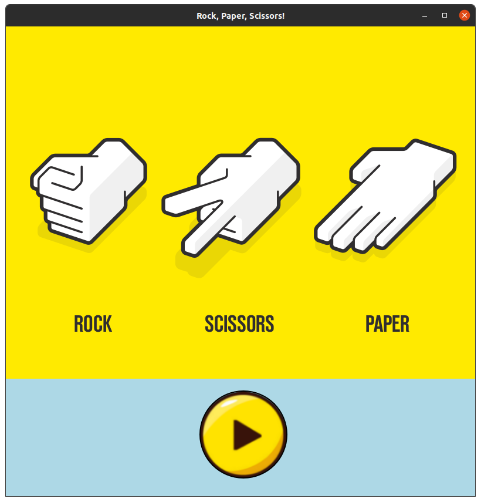

# Rock-Paper-Scissors
A Rock paper scissors game developed using Mediapipe framework and Image processing techniques, along with PyQT5 as Graphical User Interface. Have fun!  
  
(Click in the image below for a demo clip)
  

### Install required Python libraries & packages
`pip install -r requirements.txt`
### Start the game
`python main.py`  
  
*Note: The game is programmed to work best within **50cm** from the distance of the hand position to the recognition camera*
